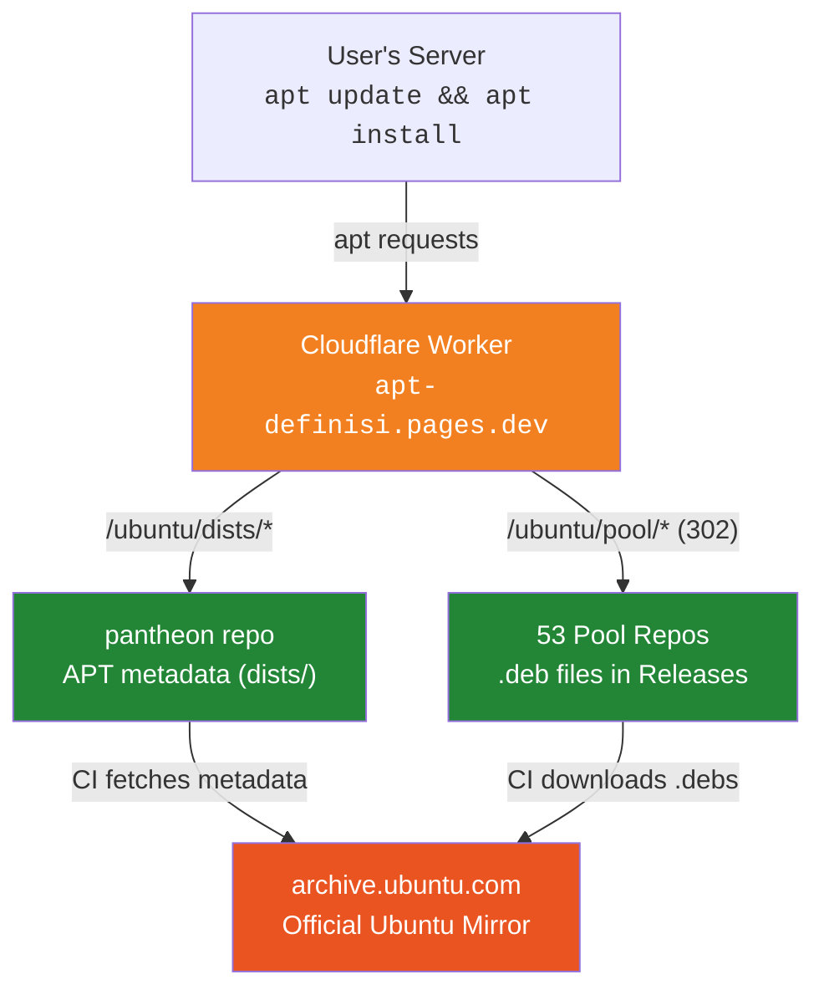

<p align="center">
  
  
  
</p>

# apt-gh

A full Ubuntu APT package mirror hosted entirely on GitHub. Packages are stored as GitHub Release assets across 53 repositories, with a Cloudflare Worker providing an APT-compatible proxy layer. All syncing runs via GitHub Actions — zero local infrastructure required.

## Why?

- **Access from restricted networks** — servers that can only reach GitHub and Cloudflare
- **GitHub CDN speed** — fast downloads from GitHub's global edge network
- **Zero cost** — runs entirely on free tiers (GitHub public repos + Cloudflare Workers)
- **Fully automated** — syncs every 12 hours, no manual intervention

## Quick Start

### One-liner

```bash
curl -fsSL https://apt-definisi.pages.dev/setup.sh | sudo bash
```

### Manual setup

```bash
# 1. Import GPG key
curl -fsSL https://apt-definisi.pages.dev/key.gpg \
  | sudo gpg --dearmor -o /etc/apt/keyrings/apt-gh.gpg

# 2. Add mirror source
CODENAME=$(lsb_release -cs)
echo "deb [signed-by=/etc/apt/keyrings/apt-gh.gpg] https://apt-definisi.pages.dev/ubuntu $CODENAME main restricted universe multiverse" \
  | sudo tee /etc/apt/sources.list.d/apt-gh.list

# 3. Update
sudo apt update
```

### Supported releases

| Release | Codename | Status |
|---------|----------|--------|
| Ubuntu 24.04 LTS | Noble Numbat | Active |
| Ubuntu 22.04 LTS | Jammy Jellyfish | Planned |
| Ubuntu 20.04 LTS | Focal Fossa | Planned |

### Supported architectures

`amd64` `arm64` `armhf` `i386` `s390x` `ppc64el` `riscv64`

> Phase 1 currently mirrors **Noble (24.04) main amd64** only. Other suites, components, and architectures are being rolled out incrementally.

## Architecture



### How syncing works

1. **Every 12 hours**, the `pantheon` orchestrator runs via GitHub Actions
2. It fetches `Packages.gz` from `archive.ubuntu.com` and parses the package list
3. Packages are grouped by first letter and dispatched to the appropriate pool repo
4. Each pool repo downloads its `.deb` files and uploads them as GitHub Release assets
5. `pantheon` regenerates APT metadata (`Packages.gz`, `Release`, `InRelease`) and commits it

### Request flow

```
apt update
  → GET /ubuntu/dists/noble/InRelease
  → CF Worker proxies from GitHub Raw (pantheon repo)

apt install htop
  → GET /ubuntu/pool/main/h/htop/htop_3.3.0-4_amd64.deb
  → CF Worker: parse path → repo "hydra", tag "noble-main"
  → 302 redirect to github.com/apt-gh/hydra/releases/download/noble-main/htop_3.3.0-4_amd64.deb
```

## Repository Map

Packages are distributed across 53 pool repositories, each named after a mythological figure. The repository name maps to the first letter(s) of the packages it stores.

### Regular packages (a-z, 0-9)

| Repo | Letter | Repo | Letter | Repo | Letter |
|------|--------|------|--------|------|--------|
| [apollo](https://github.com/apt-gh/apollo) | a | [kraken](https://github.com/apt-gh/kraken) | k | [ullr](https://github.com/apt-gh/ullr) | u |
| [banshee](https://github.com/apt-gh/banshee) | b | [leviathan](https://github.com/apt-gh/leviathan) | l | [valkyrie](https://github.com/apt-gh/valkyrie) | v |
| [cerberus](https://github.com/apt-gh/cerberus) | c | [minotaur](https://github.com/apt-gh/minotaur) | m | [wendigo](https://github.com/apt-gh/wendigo) | w |
| [draco](https://github.com/apt-gh/draco) | d | [nemesis](https://github.com/apt-gh/nemesis) | n | [xenos](https://github.com/apt-gh/xenos) | x |
| [echidna](https://github.com/apt-gh/echidna) | e | [odin](https://github.com/apt-gh/odin) | o | [ymir](https://github.com/apt-gh/ymir) | y |
| [fenrir](https://github.com/apt-gh/fenrir) | f | [phoenix](https://github.com/apt-gh/phoenix) | p | [zeus](https://github.com/apt-gh/zeus) | z |
| [griffin](https://github.com/apt-gh/griffin) | g | [quetzalcoatl](https://github.com/apt-gh/quetzalcoatl) | q | [omega](https://github.com/apt-gh/omega) | 0-9 |
| [hydra](https://github.com/apt-gh/hydra) | h | [ragnarok](https://github.com/apt-gh/ragnarok) | r | | |
| [ifrit](https://github.com/apt-gh/ifrit) | i | [scylla](https://github.com/apt-gh/scylla) | s | | |
| [jormungandr](https://github.com/apt-gh/jormungandr) | j | [titan](https://github.com/apt-gh/titan) | t | | |

### lib\* packages (liba-libz, lib0)

| Repo | Prefix | Repo | Prefix | Repo | Prefix |
|------|--------|------|--------|------|--------|
| [atlas](https://github.com/apt-gh/atlas) | liba | [karma](https://github.com/apt-gh/karma) | libk | [umbra](https://github.com/apt-gh/umbra) | libu |
| [bifrost](https://github.com/apt-gh/bifrost) | libb | [loki](https://github.com/apt-gh/loki) | libl | [viper](https://github.com/apt-gh/viper) | libv |
| [chimera](https://github.com/apt-gh/chimera) | libc | [morpheus](https://github.com/apt-gh/morpheus) | libm | [wraith](https://github.com/apt-gh/wraith) | libw |
| [daemon](https://github.com/apt-gh/daemon) | libd | [nyx](https://github.com/apt-gh/nyx) | libn | [xerxes](https://github.com/apt-gh/xerxes) | libx |
| [excalibur](https://github.com/apt-gh/excalibur) | libe | [ouroboros](https://github.com/apt-gh/ouroboros) | libo | [yaksha](https://github.com/apt-gh/yaksha) | liby |
| [fury](https://github.com/apt-gh/fury) | libf | [pandora](https://github.com/apt-gh/pandora) | libp | [zephyr](https://github.com/apt-gh/zephyr) | libz |
| [gorgon](https://github.com/apt-gh/gorgon) | libg | [quasar](https://github.com/apt-gh/quasar) | libq | [oblivion](https://github.com/apt-gh/oblivion) | lib0-9 |
| [helios](https://github.com/apt-gh/helios) | libh | [reaper](https://github.com/apt-gh/reaper) | libr | | |
| [icarus](https://github.com/apt-gh/icarus) | libi | [styx](https://github.com/apt-gh/styx) | libs | | |
| [janus](https://github.com/apt-gh/janus) | libj | [thanatos](https://github.com/apt-gh/thanatos) | libt | | |

## Project Structure

```
pantheon/
├── dists/                          # APT metadata (auto-generated by CI)
│   └── noble/
│       ├── Release / InRelease     # GPG-signed release files
│       └── main/binary-amd64/     # Packages.gz, Packages.xz
├── scripts/
│   ├── orchestrator.py             # Master sync: fetch, diff, dispatch
│   ├── generate_metadata.py        # Rebuild Packages.gz, Release, sign
│   ├── pool_sync.py                # Per-pool-repo sync (copied to each)
│   ├── create_pool_repos.py        # One-time: create all 53 pool repos
│   ├── repo_map.json               # Mythology name → letter mapping
│   └── config.json                 # Suites, components, architectures
├── worker/
│   ├── src/index.ts                # Cloudflare Worker entry point
│   ├── wrangler.toml               # Worker configuration
│   └── package.json
├── keys/
│   └── public.gpg                  # GPG public key for APT verification
├── setup.sh                        # End-user one-liner setup
└── .github/workflows/
    ├── sync.yml                    # Cron sync every 12 hours
    ├── deploy-worker.yml           # Auto-deploy CF Worker
    └── setup-pool-repos.yml        # One-time pool repo creation
```

## Verify GPG Signatures

The mirror signs all metadata with a dedicated GPG key. To verify manually:

```bash
# Download and inspect the key
curl -fsSL https://apt-definisi.pages.dev/key.gpg | gpg --show-keys

# Verify the Release file signature
curl -fsSL https://apt-definisi.pages.dev/ubuntu/dists/noble/InRelease | gpg --verify
```

Key fingerprint: `1EB3 099E BE11 EE9D 75C7 AF73 160A 7834 FD84 7CC2`

## Technology Stack

| Component | Technology | Purpose |
|-----------|-----------|---------|
| Package storage | GitHub Releases | Unlimited storage for public repos |
| APT metadata | GitHub Raw | Serve dists/ files |
| Proxy layer | Cloudflare Workers | APT-compatible URL routing |
| Sync engine | Python 3.12 (stdlib) | No external dependencies |
| CI/CD | GitHub Actions | Automated sync every 12 hours |
| Signing | GPG (RSA 4096) | APT metadata integrity |

## Limits

| Resource | Limit | Our Usage |
|----------|-------|-----------|
| GitHub Release assets | Unlimited (public) | ~1.5 TB target |
| CF Worker requests | 100k/day (free) | Fine for personal use |
| GitHub Actions | Unlimited minutes (public repos) | ~53 parallel sync jobs |
| GitHub API | 5,000 req/hr (authenticated) | Staggered dispatches |

## Rollout Plan

- [x] **Phase 1:** Noble `main` `amd64` (~20 GB)
- [ ] **Phase 2:** Noble all components, all architectures (~80 GB)
- [ ] **Phase 3:** Add Jammy + Focal (~240 GB)
- [ ] **Phase 4:** Full mirror (~1.5 TB)

## Contributing

Found a bug or want to add a feature? Contributions are welcome.

1. Fork the [pantheon](https://github.com/apt-gh/pantheon) repo
2. Create a feature branch
3. Submit a pull request

The sync scripts are in `scripts/` and the Cloudflare Worker is in `worker/`. Both are straightforward Python and TypeScript with no external dependencies.

## License

MIT
